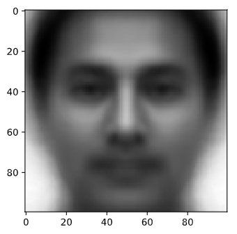
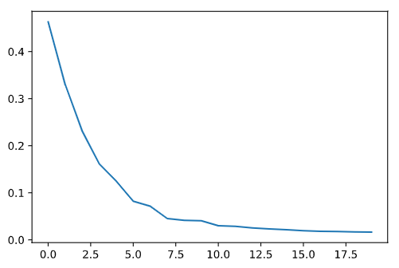
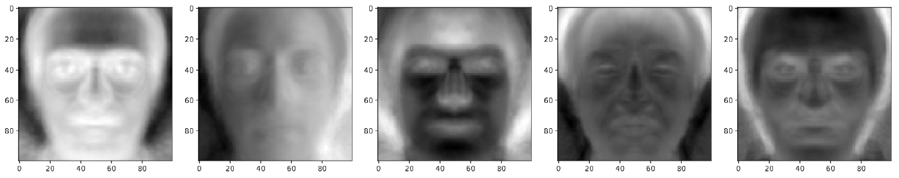
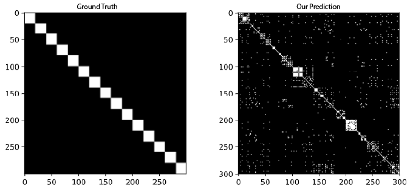

# Assignment-2 EE321 Probability and Random Processes
This repository was made as an assigmnet for the FALL2020 course EE321. In this project we demonstrate the Viola-Jones algorithm for detecting faces and Eigen Faces 
method to recognise various faces.

## Table of contents
* [Problem Statement](#problem-statement)
* [Background](#background)
* [Dataset](#dataset)
* [Technologies](#technologies)
* [Setup](#setup)
    * [Face Detection](#1.-Viola-Jones-Face-Detection)
    * [Face Recognition](#2.-Eigen-Faces---Face-Recognition)
* [References](#references)

## Problem Statement
You all are aware that face recognition is a method of identifying or verifying the identity of an individual using their face. A typical face recognition system involves face detection followed by classification. In this assignment, you will be implementing the classic Viola Jones Algorithm for detecting the face(s) in the image and then classify the detected faces using the idea of Eigen Faces.

## Background
This piece of work by Viola-Jones was notable for a couple of reasons. One,
it was the major use of Machine learning and Computer Vision. Two, was the
very fast commercialization of this algorithm. This academic piece of research
published in 2001, went on to be shipped into digital cameras. Undoubtedly,
it’s an interesting chance to explore and understand how well could you apply
your theory to practice.

## Dataset
The [Yale Face Database](http://cvc.cs.yale.edu/cvc/projects/yalefaces/yalefaces.html) (size 6.4MB) contains 165 grayscale images in GIF format of 15 individuals. 
There are 11 images per subject, one per different facial expression or configuration: 
center-light, w/glasses, happy, left-light, w/no glasses, normal, right-light, sad, sleepy, surprised, and wink.

## Technologies
The project uses Python >= 3.5

Other technologies used
* Jupyter Notebook
* OpenCV
* Pillow
* Matplotlib
* Numpy
* Tqdm

##### * The project is also compatible with [Google Colabaratory](https://colab.research.google.com/)
	
## Setup
There are two parts in this project. 
### 1. Viola Jones Face Detection
The Viola Jones Algorithm was developed around 2001, and is a form of an Essemble Classifier.

The Essemble Classifier consists of small weak classfier in cascaded feature in order to find out some features in the input images. The Essembler Classifier are effecient as the images that pass the introductory classifier layers only make it to the more complex layers, the deeper the image is passed into the cascade the complex tests it has to pass. Thus making it sort of a series decision layer kind of an architecture.  

We train a Haar-Cascade for the following problem. Haar-Cascades can be trained easily using pre-defined functions in OpenCV.

Using the [PrepareData_ForCascade.ipynb](https://github.com/varunjain3/EigenFaces/blob/master/PrepareData_ForCascade.ipynb) we create the postive and negative samples for training the Haar-Cascade in OpenCV.

After getting the data ready for training the Cascade, we use a [repository](https://github.com/mrnugget/opencv-haar-classifier-training) provided by [mrnugget](https://github.com/mrnugget). The classifier training code is present in the [Train_Cascade.ipynb](https://github.com/varunjain3/EigenFaces/blob/master/Train_Cascade.ipynb).

For this project we have trained our Cascade Classifier using the Yale Dataset and its flipped images. We procured the negative images from [repository](https://github.com/JoakimSoderberg/haarcascade-negatives) provided by [JoakimSoderberg](https://github.com/JoakimSoderberg).

The trained classifier .xml files are stored in the [classifier folder](https://github.com/varunjain3/EigenFaces/tree/master/classifier). To demonstrate our trained classifier, we have created another file [Testing_TrainedClassifier.ipynb](https://github.com/varunjain3/EigenFaces/blob/master/Testing_TrainedClassifier.ipynb). 

### 2. Eigen Faces - Face Recognition
Eigen Faces is a method based upon the famous PCA Reduction technique.

In this method, we normalize all the images by subtracting them with an average face. This average face is caculated by taking a mean of all the pixel values of the faces. We get this average face 

Then these normalised images are used to calculate a covariance matrix of size m by m (m = number of images). For this covariance matrix, we calculate the eigen values and eigen vectos. These are the 20 Eigen values in the decreasing order of their value. 

These are the Eigen faces corresponding to the top 5 eigen values. 

When looking at the covariance matrix, we observe that, Eigen face method has some problems yet the observation show that it is indeed a good method. 

Implemention for Eigen Faces is present in the [EigenFace_Method.ipynb](https://github.com/varunjain3/EigenFaces/blob/master/EigenFace_Method.ipynb).
* Train Accuracy: 60-80% ( * depending on the threshold)
* Test Accuracy: 50-70%
## References
1. P. Viola and M. Jones, "Rapid object detection using a boosted cascade of simple features," Proceedings of the 2001 IEEE Computer Society Conference on Computer Vision and Pattern Recognition. CVPR 2001, Kauai, HI, USA, 2001, pp. I-I, doi: 10.1109/CVPR.2001.990517.
2. M. A. Turk and A. P. Pentland, "Face recognition using eigenfaces," Proceedings. 1991 IEEE Computer Society Conference on Computer Vision and Pattern Recognition, Maui, HI, USA, 1991, pp. 586-591, doi: 10.1109/CVPR.1991.139758.
